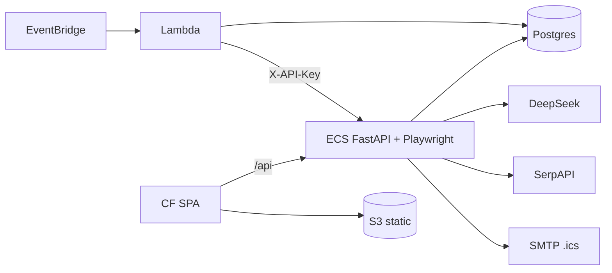

# Call architecture — Earnings_tracker

Calendar scrape + DeepSeek summaries. **Not** portfolio `earnings_predictor`. Labels: [`systems/call-taxonomy.md`](../../systems/call-taxonomy.md).

## Kind skew

| Kind | ~ | Role |
|------|--:|------|
| data_fetch_web | 5 | SerpAPI, httpx IR, curl_cffi, Playwright, SEC |
| job_orchestrate | 4 | EventBridge weekly/hourly, locks, summary batches |
| data_fetch_internal | 2 | Postgres reads, SPA→API |
| data_write_internal | 2 | Postgres upserts |
| reasoning_llm | 1 | DeepSeek extract/rank/summary |
| proxy_forward | 1 | Lambda → ECS summary API |
| binary_media | 1 | CF→S3 SPA assets |
| health_ops | 1 | `/api/health` |
| other:smtp_email | 1 | `.ics` invites |

## Dense edges

| caller | callee | kind | purpose | auth |
|--------|--------|------|---------|------|
| EventBridge weekly | Lambda `earnings-tracker` | job_orchestrate | Mon 08:00 UTC scrape | events→lambda |
| EventBridge hourly | Lambda `generate_summaries` | job_orchestrate | 1h/2h/3h post-event | events→lambda |
| Lambda / FastAPI | Postgres RDS | data_fetch_internal / write | companies/events/summaries | DATABASE_URL |
| Lambda | `SUMMARY_API_URL` ECS FastAPI | proxy_forward | Playwright tier outsource | X-API-Key |
| `smart_finder` / webcast / summary_finder | SerpAPI | data_fetch_web | search | SERPAPI_KEY |
| extract/ranker/finders | DeepSeek (`api.deepseek.com`) | reasoning_llm | extract/rank/verify | OPENAI_API_KEY→DeepSeek |
| `summary/fetch` | IR/PDF hosts httpx | data_fetch_web | document fetch | none |
| `summary/fetch` curl_cffi | sites w/ TLS blocks | data_fetch_web | JA3 impersonation | none |
| `ir_navigation` + Playwright | JS IR pages | data_fetch_web | browse | none (ECS image) |
| `summary/sec_handler` | SEC URLs | data_fetch_web | filings | UA |
| `calendar_sender` | SMTP O365/Gmail | other:smtp_email | `.ics` invites | SMTP creds |
| React web CF | `/api/*` → ALB | data_fetch_internal | dashboard | reads open; writes key |
| CF origin | S3 web bucket | binary_media | SPA assets | OAC |
| FastAPI `/api/health` | ops | health_ops | health | none |
| `distributed_locks` | Postgres | job_orchestrate | 600/180/300/400s locks | DB |

Models: `deepseek-v4-pro` (finder/webcast/extract) vs `deepseek-chat` (summary) — [`ai-prompting.md`](./ai-prompting.md).

## Architecture

