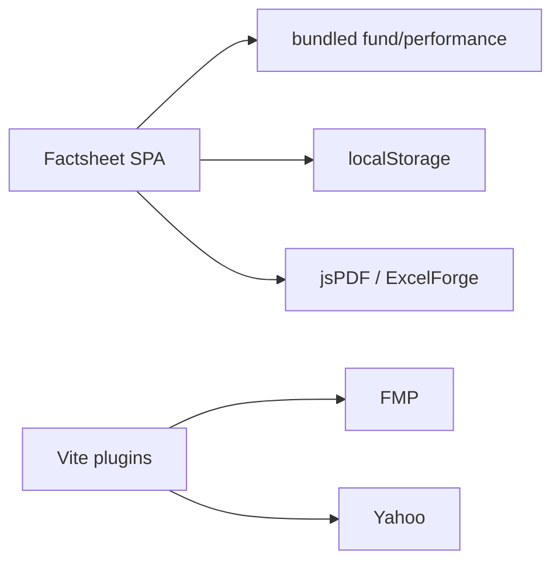

# Call architecture — Factsheet-Automation

Client-only marketing factsheet. **No `reasoning_llm`.** Labels: [`systems/call-taxonomy.md`](../../systems/call-taxonomy.md).

## Kind skew

| Kind | ~ | Role |
|------|--:|------|
| data_fetch_market | 2 | Dev Vite plugins → FMP + Yahoo |
| binary_media | 2 | Client PDF + Excel export |
| data_fetch_internal | 2 | Bundled `src/data/*` + optional holdings URL |
| proxy_forward | 1 | Dev `/api/portfolio/top5` Vite plugin |
| other:browser_storage | 1 | localStorage overrides |

## Dense edges

| caller | callee | kind | purpose | auth |
|--------|--------|------|---------|------|
| `vite.portfolioApi` (dev) | FMP profile + EOD | data_fetch_market | re-rank top5 by price | FMP_KEY |
| `vite.sp500Api` (dev) | Yahoo chart | data_fetch_market | ^SP500TR monthly | none |
| `api/holdings.ts` | optional `VITE_HOLDINGS_API_URL` | data_fetch_internal | external holdings book | optional key |
| SPA | Vite `/api/portfolio/top5` | proxy_forward | dev re-rank | local |
| `exportFactsheetPdf` | html2canvas + jsPDF | binary_media | PDF | none |
| `exportPerformanceExcel` | ExcelForge | binary_media | xlsx | none |
| App / top5 cache | localStorage | other:browser_storage | month overrides | none |
| static `src/data/*` | bundled TS | data_fetch_internal | fund/performance/S&P stub | none |

## Architecture

Admin twin (server Dynamo+FMP): portal `/strategy-factsheet` — see portal `call-architecture.md` / `admin-factsheet.md`.
