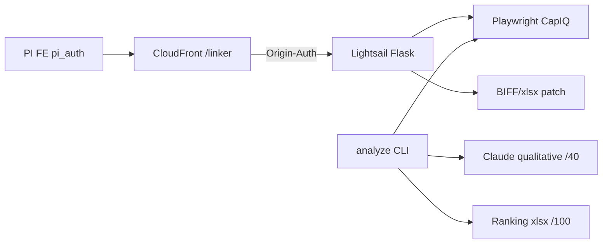

# Call architecture — Linker

Two surfaces: **CLI analyzer** (CapIQ + Claude qualitative) and **Flask `capiq_linker`** (hyperlink patch — **no LLM**). Labels: [`systems/call-taxonomy.md`](../../systems/call-taxonomy.md).

## Kind skew

| Kind | ~ | Role |
|------|--:|------|
| data_fetch_market | 3 | CapIQ Playwright download / resolve / companyId cache |
| binary_media | 3 | Ranking xlsx, BIFF patch, user download |
| reasoning_llm | 1 | Claude qualitative /40 — **CLI only** |
| auth_identity | 1 | PI JWT `pi_auth` cookie |
| proxy_forward | 1 | CF/nginx → Lightsail + Origin-Auth |
| data_write_internal | 1 | local job store |
| health_ops | 1 | `/healthz` |

## Dense edges

| caller | callee | kind | purpose | auth |
|--------|--------|------|---------|------|
| `capiq/runner` Playwright | CapIQ Key Stats Excel | data_fetch_market | download financials | CapIQ accounts |
| `capiq/analysis/qualitative` | Anthropic `claude-sonnet-4-6` | reasoning_llm | qualitative /40 | ANTHROPIC_API_KEY |
| `analyze_capital_allocation` | parsers + openpyxl | binary_media | Q40+F60→/100 workbook | none |
| `build_companyid_cache` | CapIQ Playwright | data_fetch_market | ticker→companyId CSV | CapIQ |
| Flask `resolver` | CapIQ Playwright pool | data_fetch_market | resolve IDs for upload | CapIQ; job mutex |
| `excel_linker` / `biff_patcher` | local BIFF/xlsx | binary_media | inject CapIQ hyperlinks | none |
| `auth.require_pi_auth` | PI JWT HS256 | auth_identity | gate routes except healthz | `PI_JWT_SECRET` = .NET Jwt |
| CF / nginx | Lightsail `:5050` | proxy_forward | `/linker*` | X-Origin-Auth + cookie |
| Flask job store | `jobs_data` FS | data_write_internal | job TTL 24h; ON_HOLD 90×3 | FS |
| `/healthz` | ops | health_ops | public | none |
| download route | patched workbook | binary_media | user download | pi_auth |

## Architecture

≠ CapIQ Screen agent (`13.62.39.214`) — separate CapIQ consumer.
