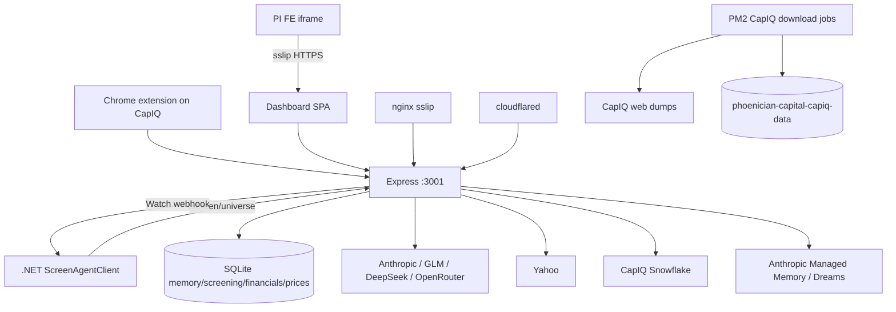

# Call architecture — capiq-screen-agent

Labels: [`systems/call-taxonomy.md`](../../systems/call-taxonomy.md).

## Kind skew

| Kind | Role |
|------|------|
| reasoning_llm | Chat, screen triage, auditor, NE, Dreams, suggest, compare judges |
| data_fetch_market | CapIQ Snowflake, Yahoo quotes/FX, CapIQ ADV/ownership/price feeds |
| data_fetch_web | Anthropic `web_search` tool (chat/screen/auditor) |
| data_fetch_internal | Extension/dashboard → Express; .NET → `/screen/universe`; SQLite reads |
| data_write_internal | SQLite writes; Managed Memory mirror; Watch webhook → PI |
| auth_identity | Dashboard `dash_sess`; PI embed trust skip; CapIQ page session (browser) |
| realtime_push | `/screen/stream` SSE; PI↔iframe postMessage; extension SW keep-alive |
| proxy_forward | nginx sslip paths; cloudflared → :3001 |
| job_orchestrate | Screen runs, live-price 15m, split-repair, NE rescore, Dream cron, CapIQ download PM2 |
| binary_media | Attachments, export.docx/json, S3 DB backups |
| billing_vendor / health_ops | `/admin/usage` local audit |
| other:embed | PI FE iframe to sslip dashboard |
| embedding_rag | Managed Memory stores (Dream/curated) — Anthropic memory, not Vertex |

## Dense edges

| caller | callee | kind | purpose | auth |
|--------|--------|------|---------|------|
| Chrome extension SW | Express `:3001` | data_fetch_internal / write | chat/suggest/transcripts | API open; long timeouts |
| Dashboard SPA | Express | data_fetch_internal / write + SSE | universe/memory/brain | `dash_sess` / embed trust |
| PI FE iframe | sslip `/dashboard/` | other:embed | Screen UI in PI | PI login + embed origins |
| PI FE ↔ iframe | postMessage | realtime_push | `PI_REQUEST_TICKER` handoff | origin-checked |
| .NET `ScreenAgentClient` | `GET /screen/universe` | data_fetch_internal | company search | none; 2500ms; Postgres fallback |
| Express `webhooks.js` | `PHOENICIAN_WEBHOOK_URL` | data_write_internal | Watch verdict notify | `X-Webhook-Key` |
| `question-engine` / `llm.js` | Anthropic / GLM / DeepSeek / OR | reasoning_llm | chat + tools | API keys |
| `screening-worker` | Anthropic / GLM / DeepSeek / OR | reasoning_llm | Pass/Watch triage | API keys |
| Auditor domain | Anthropic + web_search | reasoning_llm + data_fetch_web | identify/gate | API key |
| Auditor / scripts | CapIQ Snowflake | data_fetch_market | financials/IDs/mcap | Snowflake reader |
| `quote-feed` / live-price | Yahoo Finance | data_fetch_market | quotes/FX | public |
| `capiq-*-feed` / ADV | Snowflake / CapIQ | data_fetch_market | prices/ownership/ADV | breaker cooldown |
| `managed-agents.js` | Anthropic Managed Agents / Dreams | reasoning_llm + memory write | suggest + Dreams | agent IDs |
| `raw-store-mirror` | Anthropic memory store | data_write_internal | mirror sessions | API key |
| Compare judges | OpenAI / Claude | reasoning_llm | blind A/B | keys |
| nginx / cloudflared | local Express | proxy_forward | HTTPS routing | TLS / tunnel |
| PM2 `*-download.config.js` | `phoenician-capiq download` | job_orchestrate + data_fetch_market | CapIQ Excel dumps | CapIQ accounts |
| `backup-to-s3.sh` | S3 backup bucket | binary_media | nightly DB backup | IAM |
| snowflake-mcp (Cursor) | Snowflake | data_fetch_market | ad-hoc SELECT | reader; not public API |

## Architecture

**Not evidenced:** Linker edge from this tree. Playwright CapIQ scrape is sibling download tooling, not Express.
