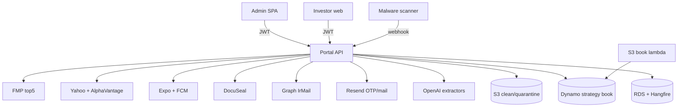

# Call architecture — investor-portal-backend

.NET API + admin/investor React + tools. Labels: [`systems/call-taxonomy.md`](../../systems/call-taxonomy.md).

**Corrections vs older assumptions:** transactional email is **Resend** (not SES). Live e-sign is **DocuSeal** (`DocuSignService` exists but is **not DI-wired**). No `embedding_rag`.

## Kind skew

| Kind | ~ | Role |
|------|--:|------|
| other | 10 | Resend, Graph IrMail, DocuSeal(+webhook), DocuSign dead, scan webhook, Secrets, local tools |
| auth_identity | 5+ | JWT, OTP, TOTP, HIBP, App Store bypass |
| data_fetch_internal | 8 | RDS, Dynamo, S3 get, admin API, monitoring |
| data_write_internal | 6 | RDS, S3 put, Dynamo lambda, uploads |
| reasoning_llm | 6 | OpenAI extractors (admin docs AI only) |
| data_fetch_market | 3–8 | Yahoo, AlphaVantage, FMP top5 (+ orphan SP500 FE) |
| binary_media | 5 | S3 presign, videos, share upload, PDF bytes |
| job_orchestrate | 4 | Hangfire + 3 jobs |
| realtime_push | 2 | Expo + FCM send |
| health_ops | 2–3 | `/health`, CSP, app version |
| proxy_forward | 1 | `/api/documents/proxy` → S3 |
| embedding_rag / billing_vendor | **0** | |

## Dense edges — API

| caller | callee | kind | purpose | auth |
|--------|--------|------|---------|------|
| `OpenAiNameExtractor` | OpenAI chat/completions | reasoning_llm | AI rename | Bearer; gpt-4o-mini |
| `OpenAiStatementSegmenter` | OpenAI | reasoning_llm | split multi-statement PDFs | gpt-4o-mini |
| `OpenAiAnnualReportYearExtractor` | OpenAI | reasoning_llm | report year | gpt-4o-mini |
| `OpenAiSubscriptionDateExtractor` | OpenAI | reasoning_llm | sub date text→vision | gpt-4o-mini |
| `OpenAiContractNoteExtractor` | OpenAI | reasoning_llm | amounts / routing | mini + gpt-4o vision |
| `OpenAiContractNoteTypeVerifier` | OpenAI | reasoning_llm | note type verify | gpt-4o-mini |
| `MarketDataService` | Yahoo query2 chart | data_fetch_market | portfolio quotes | none (UA); 5m cache |
| `MarketDataService` | Alpha Vantage NEWS_SENTIMENT | data_fetch_market | company news | apikey; 30m cache |
| `StrategyTop5Service` | FMP profile + EOD | data_fetch_market | live top5 re-rank | FMP from Secrets |
| `StrategyBookStore` | Dynamo `phoenician-capital-strategy-book` | data_fetch_internal | weights/anchor | IAM |
| `S3StorageService` | clean + quarantine S3 | data_fetch_internal / write / binary_media | docs/KYC/videos + presign ~300s | IAM |
| EF `AppDbContext` | RDS Postgres | data_fetch_internal / write | domain + Hangfire store | conn |
| Hangfire jobs | Resend/push/DocuSeal/RDS | job_orchestrate | KYC expiry 08:00; refresh cleanup; signing recovery 10m | DI |
| `EmailService` | Resend `POST /emails` | other:transactional_email | OTP, reset, KYC warn, invites | Resend key |
| `IrMailService` | AAD + Graph sendMail | other:graph_mail | IR campaigns + SSE | client creds/refresh |
| `DocuSealService` | api.docuseal.com | other:esign_vendor | templates/submissions/signed PDF | X-Auth-Token |
| DocuSeal webhooks | InvestorFormsController | other:esign_webhook | signing complete | signature/token |
| `DocuSignService` | DocuSign REST | other:esign_vendor | **not DI-registered** | JWT |
| `ExpoPushNotificationService` | exp.host push/send | realtime_push | iOS Expo | none on HTTP |
| `FcmPushNotificationService` | Firebase FCM | realtime_push | Android | service account |
| `PasswordService` | api.pwnedpasswords.com/range | auth_identity | HIBP k-anon | fail-open |
| `JwtService` / TOTP / AppStoreReview | local + config | auth_identity | tokens / reviewer OTP | Secrets + AES |
| `AppVersionController` | iTunes Lookup | data_fetch_web | live iOS version | none; 1h cache |
| `DocumentsController.Proxy` | S3 HTTPS GET | proxy_forward | browser PDF no CORS | presign; host allowlist |
| `ScanWebhookController` | inbound scanner | other:malware_scan_callback | quarantine→clean | webhook secret |
| `SecretsManagerService` | AWS SM | other:secrets_fetch | FMP etc. | IAM; 5m cache |
| HealthChecks / CSP | RDS / browser | health_ops | readiness + CSP log | none |

## Dense edges — admin FE + tools

| caller | callee | kind | purpose | auth |
|--------|--------|------|---------|------|
| `apiFetch` / `api.*` | Portal API | data_fetch_internal / write | all admin CRUD | Bearer + HttpOnly refresh |
| `authedRawFetch` | API binaries / SSE | binary_media | PDF + IR stream | Bearer |
| `irMailService` | `/api/ir-mail/*` | other:graph_mail | campaign UI | Admin JWT |
| `holdings.ts` | `/api/strategy-book/top5` | data_fetch_internal | Dynamo+FMP server | Admin JWT |
| `sp500.ts` | `/api/sp500/monthly` | data_fetch_market | **orphan — no backend route** → static fallback | — |
| DocusealBuilder/Form | DocuSeal CDN | other:esign_vendor | builder + signing | builder JWT |
| investor half `api` | Portal API | data_fetch_internal / write | investor web | investor JWT |
| logo CDNs | FMP/TV/CompaniesLogo | data_fetch_web | logos | none |
| `s3-book-sync-lambda` | S3 → Dynamo | data_fetch_internal / write | strategy JSON mirror | Lambda IAM |
| `statement-sync` | `/api/documents/upload` | data_write_internal | bulk upload CLI | Admin JWT |
| `statement-split-pdf` | local PDF | other:local_pdf_tool | JPM split — no network AI | n/a |

## Architecture

See [`ai-prompting.md`](./ai-prompting.md), [`features-inventory.md`](./features-inventory.md), [`admin-routes.md`](./admin-routes.md).
