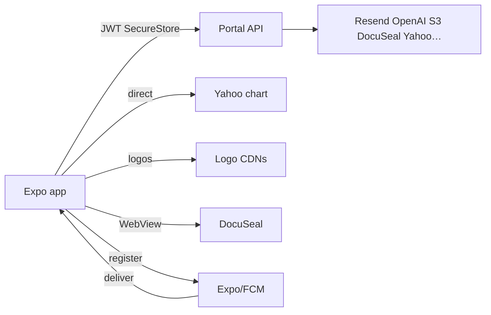

# Call architecture — investor-portal-mobile

Standalone `investor-portal-mobile/` + nested `investor-portal-backend/mobile-app/`. Both hit **portal API** (not PI). Labels: [`systems/call-taxonomy.md`](../../systems/call-taxonomy.md).

## Kind skew

| Kind | ~ | Role |
|------|--:|------|
| auth_identity | 3+ | login/OTP/TOTP/refresh, step-up, local PIN/biometrics, impersonation (standalone) |
| data_fetch_market | 2 | backend quotes/news; **also direct Yahoo** `useStockPrices` |
| realtime_push | 2 | register Expo/FCM token; OS delivery |
| data_fetch_internal / write | 2+ | `apiRequest` → portal API |
| binary_media | 1 | videos + presigned streams |
| data_fetch_web | 1 | logo CDNs |
| health_ops | 1 | app version gate (standalone) |
| other:esign_vendor | 1 | DocuSeal WebView |
| reasoning_llm | **0** | AI stays on admin backend |

## Dense edges (both forks unless noted)

| caller | callee | kind | purpose | auth |
|--------|--------|------|---------|------|
| `api.ts` `apiRequest` | `portal-api.phoeniciancapital.com` | data_fetch_internal / write | core I/O | Bearer SecureStore; refresh body |
| `authService` | `/api/auth/*` | auth_identity | login/OTP/TOTP/refresh/logout | challenge JWT |
| KYC/statements OTP / `accessOtpService` | step-up unlock APIs | auth_identity | timed unlock windows | JWT + email OTP |
| SecureStore / passcode / biometrics | local | auth_identity | QuickUnlock | device keychain |
| `impersonationService` (**standalone**) | `/api/admin/impersonation/*` | auth_identity | admin readonly | Admin → short token |
| `pushService` | Expo Notifications → `/api/auth/fcm-token` | realtime_push | register token | JWT |
| OS push | Expo/APNs/FCM → device | realtime_push | receive | platform |
| `useStockPrices` | Yahoo chart **direct** | data_fetch_market | poll ~30s | none — bypasses API |
| `useStockPricesFromBackend` | `/api/.../quote` | data_fetch_market | quotes via Yahoo BFF | JWT |
| `documentService` news | `/api/.../news` | data_fetch_market | AlphaVantage via API | JWT |
| `videoService` | videos + url/thumb | binary_media | list + stream | JWT |
| `investorFormsService` + WebView | API → DocuSeal URL | other:esign_vendor | e-sign | JWT → DocuSeal |
| logo helpers | FMP/TV/CompaniesLogo CDNs | data_fetch_web | logos | none |
| `appVersionService` (**standalone**) | `/api/app/version` | health_ops | force-update | none |

## Fork delta

| Capability | standalone | nested mobile-app |
|------------|------------|-------------------|
| Impersonation | yes | no |
| App version gate | yes | no |
| Access OTP | split services | unified `accessOtpService` |
| Direct Yahoo | yes | yes |
| Videos UI | service | service + VideoGallery/Player |
| Leftover client vendor keys in config | present unused | removed |

## Architecture

See [`screens-inventory.md`](./screens-inventory.md). Portal AI extractors: backend `call-architecture.md` — never called from mobile.
