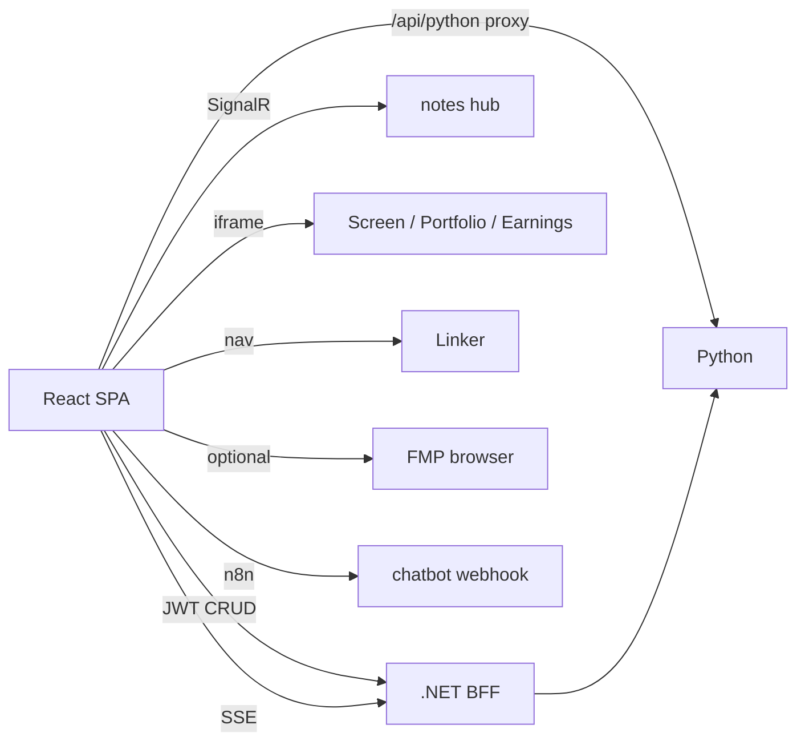

# Call architecture — phoenician-intelligence-frontend

SPA on S3/CF (`pi.phoeniciancapital.com`). Almost all product I/O is **BFF** to .NET; heavy AI via proxy/jobs. Labels: [`systems/call-taxonomy.md`](../../systems/call-taxonomy.md).

## Kind skew

| Kind | ~edges | Role |
|------|-------:|------|
| data_fetch_internal | 12 | Primary: apiClient → .NET CRUD/status/brain/costs/EFS/chatbot |
| other:embed / nav | 5 | Screen, Portfolio, Earnings, costs iframes; Linker full-nav |
| binary_media | 4 | TTS, client PDF, EFS download |
| data_write_internal | 3 | auth mutations, ticker writes, S3 upload pipeline |
| auth_identity | 2 | login/OTP + localStorage session |
| realtime_push | 2 | SignalR Yjs + SSE status-stream |
| job_orchestrate | 2 | `/jobs/*`, regenerate/H2H/RA |
| data_fetch_market | 1 | **browser FMP** (also uses .NET MarketData) |
| billing_vendor | 1 | read vendor-billing via .NET |
| health_ops | 1 | Logs/Developer |
| reasoning_llm | **0** | no local model calls |

## Dense edges

| caller | callee | kind | purpose | auth |
|--------|--------|------|---------|------|
| `apiClient` + `*Api.ts` | `VITE_API_URL` .NET `/api/*` | data_fetch_internal | CRUD ticker/user/universe/costs/notes | Bearer JWT |
| `tickerRequestApi` | .NET → Python | data_fetch_internal | report JSON/status | JWT |
| `pythonFinanceApi` MarketData* | .NET `/MarketData/*` | data_fetch_internal | quotes via BFF | JWT |
| `pythonFinanceApi` FMP paths | financialmodelingprep.com | data_fetch_market | logos/profile (browser) | VITE_FMP_API_KEY |
| `screeningApi` / `universeSearchApi` | .NET screening/universe | data_fetch_internal | filters + Screen agent | JWT |
| `brain*Api` / `companyNotesApi` / `liveCostApi` | .NET brain/notes/costs | data_fetch_internal | UI data | JWT |
| EFSBrowser / prompt-lab / ReportChatbot | `.NET/api/python` → Python | data_fetch_internal | admin FS / chatbot / prompt-lab | JWT |
| auth mutations / ticker writes | .NET Auth / TickerRequest | data_write_internal | lifecycle | JWT |
| EFS upload-presign → S3 PUT → ingest | S3 + Python | data_write_internal | admin upload | JWT+presign |
| `authApi` login/OTP | .NET `/auth/*` | auth_identity | JWT + `pi_auth` cookie | email OTP |
| `AuthContext` | localStorage | auth_identity | session | Bearer |
| `SignalRYjsProvider` | `{apiRoot}/hubs/company-notes` | realtime_push | collab notes | JWT |
| RequestedTickers `EventSource` | `/tickerrequest/status-stream` | realtime_push | live report status | JWT query |
| `asyncJobService` / regenerate APIs | .NET jobs / TickerRequest | job_orchestrate | notes AI + DD jobs | JWT |
| `openAiSpeech.ts` | .NET `/tts/speech` (prod) | binary_media | TTS | JWT |
| `vite/openaiTtsProxy.ts` | OpenAI speech | binary_media | **dev-only** | local key |
| `pdfExport*.ts` | jsPDF/html client | binary_media | PDF export | local |
| EFS download | Python via proxy | binary_media | files/zips | JWT |
| `liveCostApi` vendor-billing | .NET synced spend | billing_vendor | display | JWT |
| Logs/Developer pages | Diagnostics | health_ops | ops | developer JWT |
| `CapiqAgent` iframe | `VITE_CAPIQ_EMBED_URL` (sslip `/dashboard/`) | other:embed | CapIQ Screen Agent | PI allowlist + embed trust — see `projects/capiq-screen-agent/` |
| `PortfolioOptimizer` iframe | Amplify portfolio | other:embed | PM | portfolio auth |
| `EarningsTracker` iframe | Earnings CF | other:embed | calendar | earnings auth |
| cost embeds | peer cost URLs | other:embed | costs | peer apps |
| Navigation `/linker` | CF → Lightsail | other:embed (full nav) | Linker | `pi_auth` cookie |
| `ReportChatbot` n8n | n8n cloud webhook | other:workflow | chatbot action router | shared |

## Architecture

See also [`postmessage.md`](./postmessage.md), [`routes-inventory.md`](./routes-inventory.md).
