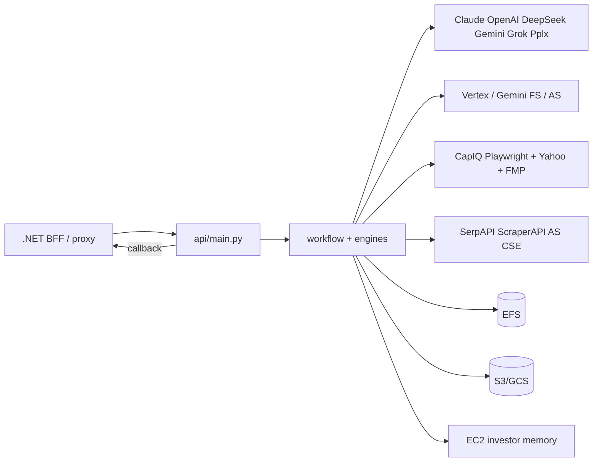

# Call architecture — phoenician-intelligence (Python)

Labels: [`systems/call-taxonomy.md`](../../systems/call-taxonomy.md). Models: [`ai-prompting.md`](./ai-prompting.md).

## Kind skew

| Kind | ~edges | Role |
|------|-------:|------|
| reasoning_llm | 9 | DD sections, H2H, RA, chatbot, cheap DeepSeek, Gemini/Grok/Pplx |
| data_fetch_web | 8 | SerpAPI, ScraperAPI, AlphaSense Playwright, CSE |
| data_fetch_internal | 6 | EFS, S3, memory SSH, .NET internal |
| data_fetch_market | 5 | CapIQ Playwright, yfinance, FMP |
| data_write_internal | 5 | EFS progress/reports, S3/GCS/Gemini upload |
| embedding_rag | 4 | Vertex, Gemini FS, AlphaSense RAG, prefetch |
| auth_identity | 3 | JWT middleware, CapIQ/AS login |
| job_orchestrate | 3 | callbacks, brain upsert, ECS task protection |
| binary_media | 3 | PDF/xlsx acquire, LibreOffice, DCF IO |
| health_ops | 2 | `/health`, status |
| other | 3 | neo4j optional, n8n pairing, universe status sync |

**This is the only tree with `embedding_rag`.** .NET does not generate DD sections.

## Dense edges

| caller | callee | kind | purpose | sync/async | auth |
|--------|--------|------|---------|------------|------|
| `llm_clients/call_claude.py` | Anthropic Messages | reasoning_llm | DD / H2H / RA / write | sync+stream+batch | Anthropic key |
| `api/_async_claude.py` | AsyncAnthropic | reasoning_llm | chatbot stream | async | Anthropic key |
| `_async_batch.py` | Anthropic Batches | reasoning_llm | prefetch query gen | async poll | Anthropic key |
| `call_openai.py` | api.openai.com | reasoning_llm | O-series, deep research, DCF | sync/stream | OPENAI_API_KEY |
| `call_deepseek.py` | api.deepseek.com | reasoning_llm | cheap DD + web_search | sync | DEEPSEEK_* |
| `call_gemini.py` | google.genai | reasoning_llm | Gemini write/JSON (+GoogleSearch) | sync | GEMINI_API_KEY |
| `call_grok.py` | xai_sdk | reasoning_llm | Grok + x_search | sync | GROK/XAI key |
| `call_perplexity.py` | api.perplexity.ai | reasoning_llm | sonar research | sync | PERPLEXITY_API_KEY |
| `llm_client_manager.py` | Claude→Gemini failover | reasoning_llm | provider fallback | sync | multi-key |
| `vertex_ai_search_retrieval.py` | Discovery Engine + GCS | embedding_rag | section RAG | sync | GCP WIF |
| `gemini_file_retrieval.py` | Gemini File Search | embedding_rag | PDF corpus | sync | Gemini key |
| `alphasense_file_retrieval.py` | Gemini FS over AS PDFs | embedding_rag | AS RAG s5/s11 | sync | Gemini key |
| `rag_prefetch.py` | Vertex/Gemini/AS | embedding_rag | phase prefetch | parallel | same |
| `yfinance_client.py` | Yahoo/yfinance | data_fetch_market | price/FX/hist DCF | sync | none |
| `fmp_client.py` / prefetch | financialmodelingprep.com | data_fetch_market | quotes/profile | sync | FMP_KEY |
| `capiq-excel-downloads` + filings | Playwright capitaliq.com | data_fetch_market | Excel/PDF → EFS | sync browser | CapIQ pool |
| `web_search.py` | LLM web tools | data_fetch_web | section web context | sync | provider |
| `rfw_serp.py` / ir_email / Company_Review | serpapi.com | data_fetch_web | SERP / IR / reviews | sync | SERPAPI_KEY |
| trustpilot scraper | api.scraperapi.com | data_fetch_web | review scrape | sync | SCRAPERAPI_KEY |
| prefetch CSE | googleapis customsearch | data_fetch_web | website discovery | sync | CSE key |
| AlphaSense Playwright | research.alpha-sense.com | data_fetch_web | AS report download | sync browser | AS creds |
| loaders / admin EFS | EFS `/app/*` | data_fetch_internal | filings/reports | sync FS | mount |
| `s3_manager.py` | S3 | data_fetch_internal / write | optional raw storage | sync | IAM |
| `memory_db_client.py` | EC2 SSH + SQLite | data_fetch_internal | CIO memory | sync | SSM+SSH |
| `brain/client.py` fetch | .NET BACKEND_API_BASE | data_fetch_internal | playbook index | sync | callback secret |
| workflow / progress | EFS write | data_write_internal | reports/markers | sync FS | mount |
| Vertex/Gemini upload | GCS / Files API | data_write_internal | index for RAG | sync | WIF/key |
| `security_auth.py` | JWT / X-Callback / X-Internal | auth_identity | route protect | middleware | shared w/ .NET |
| CapIQ/AS bots | vendor login | auth_identity | session cookies | browser | user/pass |
| `send_callback_with_retry` | .NET `/internal/callbacks/report-completed` | job_orchestrate | job done webhook | async httpx | callback secret |
| `brain/client` upsert | .NET `/internal/brain/playbooks` | job_orchestrate | mine→upsert | sync | callback secret |
| `ecs_task_protection.py` | ECS UpdateTaskProtection | job_orchestrate | anti scale-in | sync | task IAM |
| LibreOffice / DCF routes | soffice / EFS xlsx | binary_media | convert + DCF IO | sync/async | JWT |
| `GET /health` | self | health_ops | Docker HEALTHCHECK | sync | public |
| neo4j_config (optional) | Neo4j | other:graph | experimental | sync | neo4j auth |
| prefetch → .NET universe | .NET universe PATCH | other:status_sync | prefetch status | sync | internal |

## Architecture

## Intentional non-edges

- CapIQ REST sample (`capIQapi.py`) is **not** the production path — Playwright is.
- Neo4j is optional / not on DD hot path.
- Chatbot n8n webhook is owned by **FE**; Python hosts `/chatbot/*` actions.
