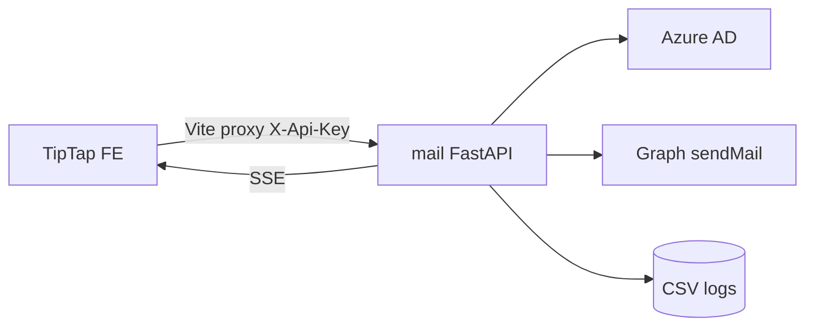

# Call architecture — phoenician-mail-sender

Local IR workstation Graph mailer. **No LLM.** Twin of portal IrMail (different stack). Labels: [`systems/call-taxonomy.md`](../../systems/call-taxonomy.md).

## Kind skew

| Kind | ~ | Role |
|------|--:|------|
| binary_media | 2 | Excel parse + PDF attachments |
| proxy_forward | 1 | Vite injects X-Api-Key |
| realtime_push | 1 | SSE send progress |
| auth_identity | 1 | Azure AD token |
| other:graph_mail | 1 | Graph sendMail |
| data_write_internal | 1 | CSV audit logs |
| health_ops | 1 | `/health` |
| job_orchestrate | 1 | send-stream / cancel campaigns |

## Dense edges

| caller | callee | kind | purpose | auth |
|--------|--------|------|---------|------|
| Vite proxy | FastAPI `:8010` | proxy_forward | inject `X-Api-Key` from root `.env` | MAIL_API_KEY |
| FE `mailApi.ts` | `/api/mail/*` | job_orchestrate / fetch | parse, upload, test-send, cancel | X-Api-Key |
| FE → send-stream | FastAPI SSE | realtime_push | per-recipient progress | X-Api-Key |
| `excel_parser` | uploaded Excel | binary_media | firstName+email | upload |
| `attachments` | PDF temp store | binary_media | magic-byte sniff | upload |
| `graph.get_access_token` | Azure AD token | auth_identity | client_credentials (pref) / ROPC | app secret |
| `graph.send_one` | Graph `/users/{mailbox}/sendMail` | other:graph_mail | send as IR | Bearer Graph |
| `campaigns` | `logs/` CSV | data_write_internal | audit | FS |
| `/health` | ops | health_ops | no API key | none |

Loopback invariant: bind `127.0.0.1` unless `MAIL_ALLOW_REMOTE=true`. Never put key in `VITE_*` when using proxy.

## Architecture

