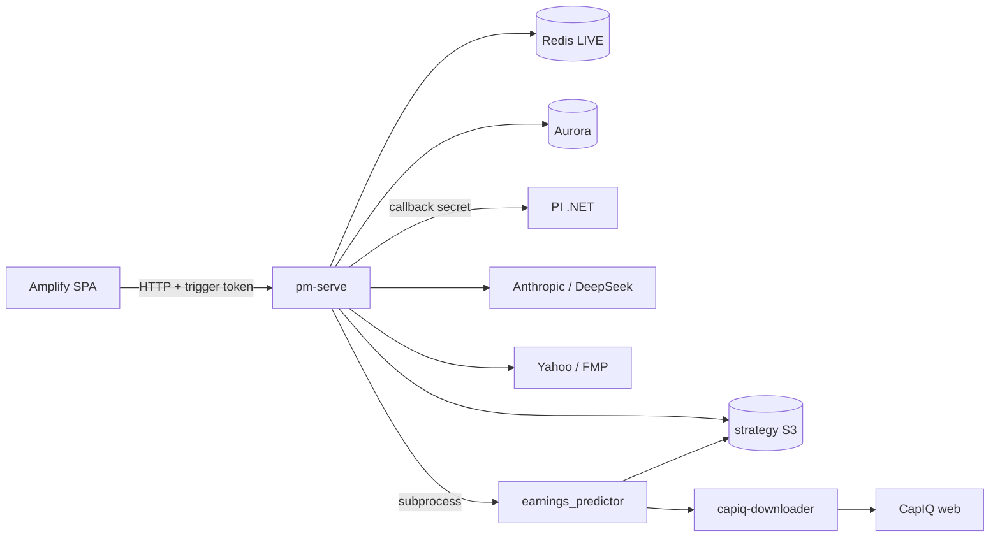

# Call architecture — phoenician-portfolio

Covers `portfolio_manager` (pm-serve + strategy), `earnings_predictor`, `capiq-downloader`, Amplify FE. Labels: [`systems/call-taxonomy.md`](../../systems/call-taxonomy.md).

## Kind skew (distinct edges)

| Kind | ~ | Role |
|------|--:|------|
| data_fetch_market | 9 | Yahoo, FMP, CapIQ Playwright, Finnhub, EDINET, shorts |
| data_fetch_web | 7 | EDGAR/OpenInsider, venue insiders, SerpAPI, macro alts, filings |
| job_orchestrate | 7 | FE triggers, EP subprocess, CapIQ refresh, PI ensure-risk, Amplify deploy |
| data_fetch_internal | 6 | S3/Aurora/Redis reads, PI client, FE→ECS |
| data_write_internal | 6 | S3 books, Aurora mirror, CapIQ/EP parquet trees |
| reasoning_llm | 5 | Claude stages/debate/lessons; DeepSeek universe; EP judge/insider/calendar |
| health_ops | 2 | `/api/health` |
| auth_identity | 1 | Secrets Manager load |
| realtime_push | 1 | Redis LIVE tips |
| embedding_rag | **0** | (PI-only) |

## Dense edges — pm-serve / strategy

| caller | callee | kind | purpose | auth |
|--------|--------|------|---------|------|
| `pi_client.PIClient` | PI .NET `/api/internal/universe*` | data_fetch_internal | DD/risk/DCF bytes | X-Callback-Secret |
| `pi_client.ensure_risk` | PI ensure-risk + poll | job_orchestrate | kick incomplete risk | callback secret |
| `strategy/claude.AnthropicClient` | Anthropic Messages | reasoning_llm | stages 0–6, debate, lessons, TT | ANTHROPIC / SM |
| debate `web_search` tool | Anthropic tool | data_fetch_web | optional grounding | Anthropic |
| `strategy/deepseek` | api.deepseek.com | reasoning_llm | optional universe-run | DEEPSEEK_API_KEY |
| prices / live_quotes / TT | Yahoo yfinance | data_fetch_market | panels, LIVE, ADV | none |
| rates / benchmark | FMP + Yahoo SPY sectors | data_fetch_market | Rf/VIX/URTH/sectors | FMP_KEY |
| `strategy/store` | S3 `phoenician-capital-strategy` | data_fetch_internal / write | books/locks | IAM |
| `store_pg` | Aurora | data_fetch_internal / write | optional mirror | DATABASE_URL |
| `redis_hot` / live_quotes | Redis | realtime_push + fetch | LIVE tips / memos | REDIS_URL |
| config / earnings_bridge | Secrets Manager | auth_identity | load vendor secrets | IAM |
| insiders Finnhub/EDINET | vendor APIs | data_fetch_market | insider txs | API keys |
| insiders EDGAR/OpenInsider/venues | web | data_fetch_web | Forms / pages | UA / none |
| `earnings_bridge` | `ep-predict` subprocess | job_orchestrate | advisory earnings | task env |
| earnings_bridge CapIQ/EP trees | S3 inputs/* | data_fetch_internal / write | sync dumps | IAM |
| pm-serve POST mutators | FE/ops | job_orchestrate | research/lessons/TT/debate | X-Trigger-Token |
| GET `/api/health` | ops | health_ops | readiness | none |

## Dense edges — earnings_predictor + capiq-downloader

| caller | callee | kind | purpose | auth |
|--------|--------|------|---------|------|
| EP `llm_battery` judge | Claude sonnet-5 | reasoning_llm | earnings judge | Anthropic |
| EP `signals/insider_llm` | Claude opus-5 | reasoning_llm | insider LLM | Anthropic |
| EP `calendar/smart_finder` | DeepSeek chat | reasoning_llm | date extract | DeepSeek |
| EP calendar | SerpAPI | data_fetch_web | IR/date search | SERPAPI_KEY |
| EP market/fx | Yahoo | data_fetch_market | OHLCV/options/FX | none |
| EP macro | FRED + official alts + Polymarket | data_fetch_market / web | macro spine | none |
| EP filings adapters | SEC/ASX/Investegate/… | data_fetch_web | announcements | UA |
| EP shorts | FCA + EU pages | data_fetch_market | short interest | none |
| EP parquet | local + S3 via bridge | data_write_internal | spine tables | IAM |
| EP `--refresh-capiq` | capiq-downloader CLI | job_orchestrate | 43 artefacts | CapIQ pool |
| `phoenician_capiq` Playwright | capitaliq.com | data_fetch_market | download artefacts | CapIQ accounts |
| downloader cache → bridge | FS → S3 `inputs/capiq/` | data_write_internal | persist UI dumps | IAM |

## Dense edges — Amplify FE

| caller | callee | kind | purpose | auth |
|--------|--------|------|---------|------|
| `lib/api.js` GETs | pm-serve `PUBLIC_API_BASE` | data_fetch_internal | books/compare/costs | CORS open reads |
| SPA POSTs | pm-serve | job_orchestrate | run/research/lessons/… | X-Trigger-Token |
| health check | `/api/health` | health_ops | reachability | none |

**FE never talks to PI directly** — only pm-serve → `pi_client`.

## Architecture

Never → ER/weights: earnings, insiders, TT, debate, lessons (`injected=false`) — see `kb-invariants.md`.
