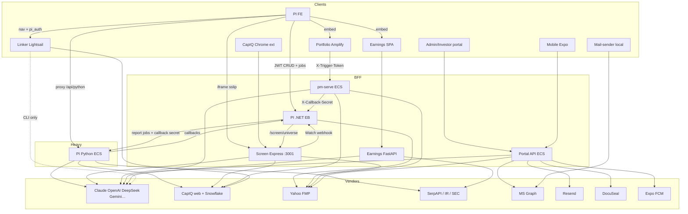

# Call architecture — platform index

Extreme pass: every product tree classified by [`call-taxonomy.md`](./call-taxonomy.md).

## Per-project docs

| Project | Doc |
|---------|-----|
| phoenician-intelligence | [`../projects/phoenician-intelligence/call-architecture.md`](../projects/phoenician-intelligence/call-architecture.md) |
| phoenician-intelligence-backend | [`../projects/phoenician-intelligence-backend/call-architecture.md`](../projects/phoenician-intelligence-backend/call-architecture.md) |
| phoenician-intelligence-frontend | [`../projects/phoenician-intelligence-frontend/call-architecture.md`](../projects/phoenician-intelligence-frontend/call-architecture.md) |
| phoenician-portfolio | [`../projects/phoenician-portfolio/call-architecture.md`](../projects/phoenician-portfolio/call-architecture.md) |
| Earnings_tracker | [`../projects/Earnings_tracker/call-architecture.md`](../projects/Earnings_tracker/call-architecture.md) |
| Linker | [`../projects/Linker/call-architecture.md`](../projects/Linker/call-architecture.md) |
| Factsheet-Automation | [`../projects/Factsheet-Automation/call-architecture.md`](../projects/Factsheet-Automation/call-architecture.md) |
| investor-portal-backend | [`../projects/investor-portal-backend/call-architecture.md`](../projects/investor-portal-backend/call-architecture.md) |
| investor-portal-mobile | [`../projects/investor-portal-mobile/call-architecture.md`](../projects/investor-portal-mobile/call-architecture.md) |
| phoenician-mail-sender | [`../projects/phoenician-mail-sender/call-architecture.md`](../projects/phoenician-mail-sender/call-architecture.md) |
| **capiq-screen-agent** | [`../projects/capiq-screen-agent/call-architecture.md`](../projects/capiq-screen-agent/call-architecture.md) |
| pi-global-app | scaffold only — no product calls yet |

## Platform kind heatmap (approx distinct edges)

| Kind | PI-Py | PI-.NET | PI-FE | Portfolio | Earnings | Linker | Factsheet | Portal | Mobile | Mail | **Screen** |
|------|------:|--------:|------:|----------:|---------:|-------:|----------:|-------:|-------:|-----:|----------:|
| reasoning_llm | 9 | 1 | 0 | 5 | 1 | 1 | 0 | 6 | 0 | 0 | **8+** |
| embedding_rag | 4 | 0 | 0 | 0 | 0 | 0 | 0 | 0 | 0 | 0 | Managed Memory* |
| data_fetch_market | 5 | 2 | 1 | 9 | 0 | 3 | 2 | 3 | 2 | 0 | **Snowflake+Yahoo** |
| data_fetch_web | 8 | 0 | 0 | 7 | 5 | 0 | 0 | 1 | 1 | 0 | web_search tool |
| data_fetch_internal | 6 | 5 | 12 | 6 | 2 | 0 | 2 | 8 | 2 | 1 | SQLite+API |
| data_write_internal | 5 | 4 | 3 | 6 | 2 | 1 | 0 | 6 | 1 | 1 | SQLite+webhook |
| auth_identity | 3 | 3 | 2 | 1 | 0 | 1 | 0 | 5 | 3 | 1 | dash_sess/embed |
| realtime_push | 0 | 2 | 2 | 1 | 0 | 0 | 0 | 2 | 2 | 1 | SSE+postMessage |
| proxy_forward | 0 | 2 | 0 | 0 | 1 | 1 | 1 | 1 | 0 | 1 | nginx/tunnel |
| job_orchestrate | 3 | 5 | 2 | 7 | 4 | 0 | 0 | 4 | 0 | 1 | screen/Dream/download |
| binary_media | 3 | 2 | 4 | 0* | 1 | 3 | 2 | 3 | 1 | 2 | exports/backups |
| billing_vendor | 0 | 7 | 1 | 0 | 0 | 0 | 0 | 0 | 0 | 0 | usage audit |
| health_ops | 2 | 2 | 1 | 2 | 1 | 1 | 0 | 2 | 1 | 1 | /admin/usage |

\*Portfolio CapIQ binaries classified at market-fetch / S3-write boundary.

## Cross-system call graph

## Canonical chains

1. **DD generate:** PI-FE → .NET TickerRequest/Jobs → Python engines (`reasoning_llm` + `embedding_rag` + CapIQ/web) → EFS write → callback → .NET → SSE FE.
2. **Portfolio research:** Amplify FE → pm-serve (`job_orchestrate`) → Claude/DeepSeek + S3 books; optional PI client for universe DD bytes.
3. **Portal docs AI:** Admin FE → Portal API → OpenAI extractors (`reasoning_llm`) → S3/RDS write.
4. **IR mail:** Admin IrMail *or* local mail-sender → Graph `sendMail` (`other:graph_mail`); OTP uses **Resend**, not SES.
5. **Linker web:** PI cookie → CF → Flask → CapIQ Playwright (`data_fetch_market`) → BIFF patch (`binary_media`); qualitative Claude is **CLI only**.
6. **Screen agent:** CapIQ extension / PI iframe → Express `:3001` (`reasoning_llm` Pass/Watch + Snowflake/Yahoo) → SQLite + Dreams; .NET only reads `/screen/universe`; Watch webhook back to PI.

Related: [`ai-prompting-map.md`](./ai-prompting-map.md) (models) · [`cap-iq-and-screen.md`](./cap-iq-and-screen.md) · [`data-flows.md`](./data-flows.md) · [`auth-boundaries.md`](./auth-boundaries.md).
